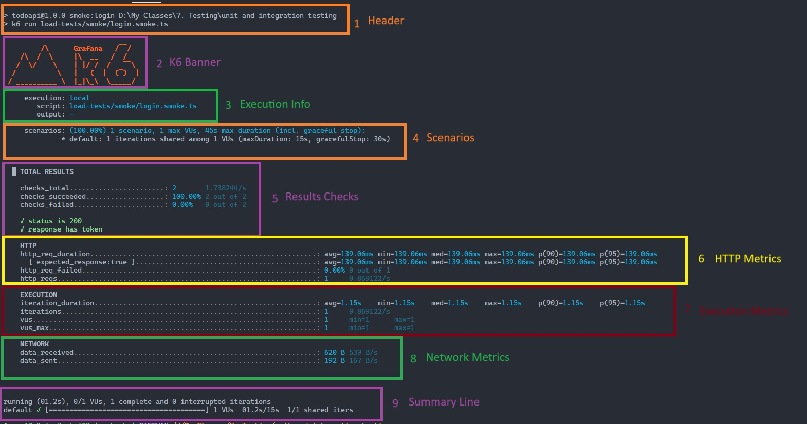
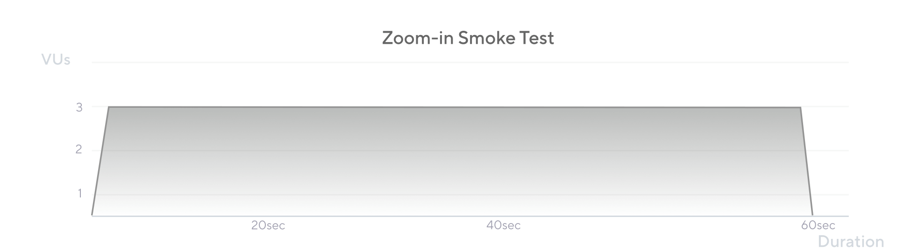
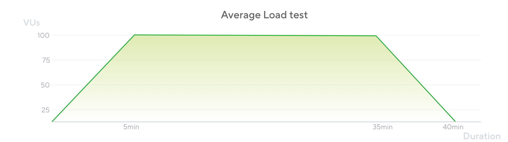
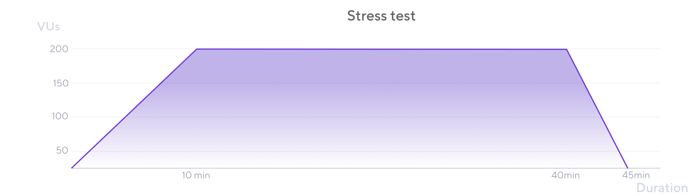
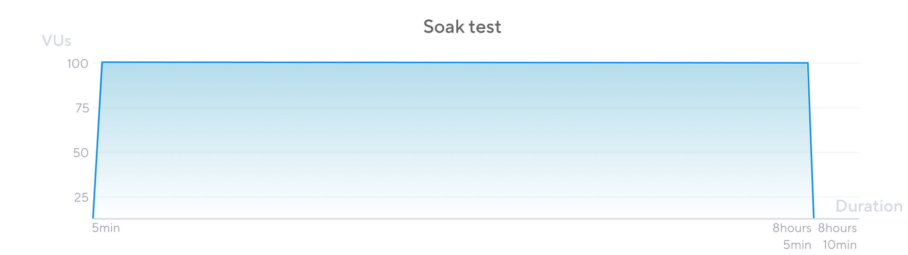
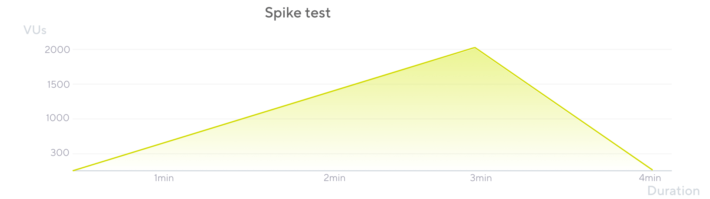
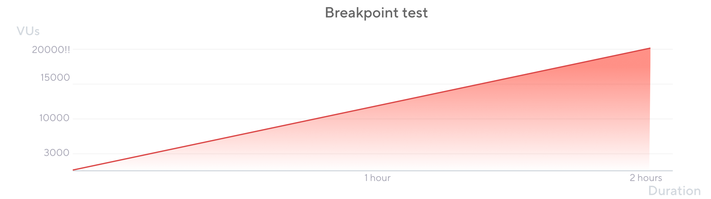

# Perfomance Testing

**Performance testing** is a type of software testing that evaluates how an application behaves under various levels of load, stress, or demand. It measures responsiveness, stability, scalability, and resource usage to ensure the system meets performance requirements.

**Why do we need performance testing?**

* **Identify bottlenecks:** Find slow parts of your system before users do.
* **Ensure reliability:** Confirm the application remains stable under expected and peak loads.
* **Validate scalability:** Check if the system can handle growth in users or data.
* **Meet SLAs:** Ensure response times and throughput meet business or contractual requirements.
* **Improve user experience:** Fast, stable applications keep users satisfied.

## K6

k6 is an open-source, developer-friendly load‑testing tool that lets you write test scripts in modern JavaScript (ES6+). It is designed for automation and CI workflows, provides built-in metrics, checks, thresholds, and supports scenario-based execution for realistic load patterns. Use k6 to validate performance, catch regressions, and measure scalability.

## Installation

### Windows (Chocolatey)

1. Open an elevated PowerShell (Run as Administrator).
2. Install k6:

   ```bash
   choco install k6 -y
   ```
3. Verify installation:

   ```bash
   k6 version
   ```
4. Uninstalling k6

   ```bash
   choco uninstall k6
   ```

### Project (TypeScript) — add k6 types

For TypeScript support and editor autocomplete, add the k6 types to your project devDependencies.

Using npm:

```bash
npm install --save-dev @types/k6
```

Using pnpm:

```bash
pnpm add -D @types/k6
```

#file:package.json
Add or update in your package.json devDependencies (example):

```json
{
  "devDependencies": {
   "@types/k6": "^1.3.1"
  }
}
```

## Perfomance Testing with K6



### Understand the K6 test ouptut


When you run a K6 script, the console displays detailed information about your test — from environment setup to metrics summary.

#### **1. Header**

* Displays the **script name** and the **command** used to start the test.
* Useful for verifying you ran the intended file or command.

#### **2. K6 Banner**

* The K6 **logo and branding** that appear at the start of each run.
* Confirms K6 is initialized and starting execution.

#### **3. Execution Info**

* **execution:** Describes where the test is running — here it’s **local** (your machine).
* **script:** The file path to your test script.
* **output:** Shows where test results are being sent — in this case, only the **console** (no external database or dashboard).

#### **4. Scenarios**

* **1 scenario:** The test uses a single scenario (no parallel configurations).
* **1 max VUs:** Only **1 Virtual User (VU)** is active during this run.
* **1 iteration:** The VU runs the script  **once** .
* **maxDuration:**
  * **Test duration:** 15 seconds
  * **Graceful stop:** 30 seconds (time K6 waits before fully stopping ongoing work)

These values define **how** and **how long** your test executes.

#### **5. Checks**

Checks validate your responses against expectations (like status codes or field presence).

* **checks_total:** Total number of checks executed — e.g., **2 checks** in this case.
* **checks_succeeded:** Percentage of passed checks (**100% passed** ).
* **checks_failed:** Percentage of failed checks (**0% failed** ).
* Example checks from the script:
  * `is status 200`
  * `response has token`

These help confirm that the API behaves as expected under load.

#### **6. HTTP Metrics**

Metrics related to HTTP requests made during the test.

* **http_req_duration:** Average  **time taken for a full request** , from start to receiving the complete response (≈  **139ms** ).
* **http_req_failed:** Percentage of **failed HTTP requests** (0% means all succeeded).
* **http_reqs:** Total number of **HTTP requests sent** during the test (e.g.,  **1 request** ).

These values are essential for spotting latency or response-time issues.

#### **7. Execution Metrics**

Show how your VUs performed during the run.

* **iteration_duration:** Total time taken for one complete test iteration (≈  **1.15s** ).
* **iterations:** Number of full test loops completed (here,  **1** ).
* **vus:** Number of Virtual Users active (here,  **1** ).

This helps measure how long the average “user journey” takes.

#### **8. Network Metrics**

Track total data transfer between client and server.

* **data_received:** Total **bytes received** from the server (e.g.,  **620 bytes** ).
* **data_sent:** Total **bytes sent** to the server (e.g.,  **192 bytes** ).

These values are useful when analyzing **bandwidth usage** and **payload size** during requests.

#### **9. Summary Lines**

At the end, K6 prints a short summary of your test:

The test ran for  **1.2 seconds** , completed  **1 iteration** , and finished successfully —

all checks passed, and no errors occurred.


## Types of Load tests

### 1. Smoke testing

A **smoke test** is a quick, lightweight check that ensures your test script and system both run without errors.

It’s like turning on a car engine to make sure it starts before going on a road trip.

**When to run:**

Run a smoke test every time you:

* Write or update a test script.
* Deploy small updates or configuration changes.

**Real-world example:**

After a developer updates the `/login` endpoint, a QA engineer runs a smoke test with 5 users for 30 seconds.

If all requests return status 200, they can safely move on to heavier tests.

Key points:

* Small number of VUs (2–20) and short test duration.
* Helps catch script or configuration errors early.
* Useful for collecting baseline performance numbers.



Quick example

```typescript
import http from "k6/http"
import { check, sleep } from "k6"

export const options = {
    vus: 3,
    duration: "30s",
}

export default () => {
    const res = http.get("http://localhost:3000/todos")
    check(res, {
        "is status 200": (r) => r.status === 200,
    })
    sleep(1)
}
```

## Average-load (day-in-life) testing

An **average-load test** simulates what a typical day looks like for your system — normal, everyday user traffic.

It shows whether your app can handle its usual workload without slowing down.

**When to run:**

Run it before releases, or after performance-related code or infrastructure changes.

**Real-world example:**

Your e-commerce site usually has around 500 concurrent shoppers during the day.

You simulate this for 30 minutes to make sure the site loads quickly and handles requests efficiently.

Key points:

* Mimics normal production usage.
* Gradually ramps up to “average” load, holds steady, then ramps down.
* Helps confirm your app performs well in typical conditions.



Quick example

```typescript
// load testing
import http from 'k6/http';
import { check, sleep } from 'k6';

export const options = {
    stages: [
        { duration: '1m', target: 100 }, // ramp up to 100 users - in real scenario, add time to 5 mins
        { duration: '2m', target: 100 }, // stay at 100 users - in real scenario, add time to 10 mins
        { duration: '30s', target: 0 },  // ramp down to 0 users
    ],
};

export default () => {
    const res = http.get('http://localhost:3000/todos');
    check(res, {
        'is status 200': (r) => r.status === 200,
    });
}

sleep(1);
```

### 3. Stress testing

A **stress test** pushes your system beyond its normal limits.

It helps you find the **breaking point** — how much traffic your system can handle before it slows down or fails.

**When to run:**

When you expect heavy activity, like payroll processing, product launches, or end-of-month reports.

**Real-world example:**

A banking app usually has 2,000 users at once, but during salary processing day it jumps to 5,000.

A stress test helps verify that the app doesn’t crash and handles these rush hours gracefully.

Key points:

* Load is higher than normal usage.
* Helps observe how the system behaves under extreme traffic.
* Reuse average-load scripts and simply increase users or request rates.



Quick example

```typescript
import http from 'k6/http';
import { check, sleep } from 'k6';


export const options = {
    stages: [
        { duration: '10m', target: 200 }, // ramp up to 200 users
        { duration: '20m', target: 200 }, // stay at 200 users
        { duration: '10m', target: 0 },   // ramp down to 0 users
    ]
};

export default () => {
    const res = http.get('http://localhost:3000/todos');
    check(res, {
        'is status 200': (r) => r.status === 200,
    });
}
sleep(1);
```

### 4. Soak (endurance) testing

A **soak test** checks how your system behaves when running under constant load for a long period — hours or even days.

It’s used to detect  **slow leaks** ,  **memory issues** , or  **gradual performance degradation** .

**When to run:**

When you want to verify long-term reliability and resource usage.

**Real-world example:**

An online learning platform runs 24/7. A soak test runs over the weekend to check if memory leaks or database slowdowns occur after long uptime.

Key points:

* Long test duration (hours to days).
* Same load level as average-load tests but for much longer.
* Monitor backend metrics like memory, CPU, and connections closely.



Quick example

```typescript
import http from 'k6/http';
import { check, sleep } from 'k6';


export const options = {
    stages: [
        { duration: '30m', target: 100 }, // ramp up to 50 users
        { duration: '5h', target: 100 },  // stay at 50 users
        { duration: '5m', target: 0 },  // ramp down to 0 users
    ]
};

export default () => {
    const res = http.get('http://localhost:3000/todos');
    check(res, {
        'is status 200': (r) => r.status === 200,
    });
    sleep(1);
}
```

### 5. Spike testing

A **spike test** checks how your system reacts to sudden, massive increases in traffic.

It’s about seeing if your system can **survive traffic spikes** and **recover quickly** afterward.

**When to run:**

When you expect sudden bursts — like flash sales, viral events, or public announcements.

**Real-world example:**

A concert ticket website suddenly receives thousands of visitors the moment sales open.

A spike test helps ensure the system doesn’t crash and can recover from the load.

Key points:

* Very rapid ramp-up and ramp-down.
* Focus on high-priority user flows (like checkout).
* Often no plateau — traffic spikes quickly, then drops.



Quick example

```typescript
import http from 'k6/http';
import { check, sleep } from 'k6';

//spike test 
export const options = {
    stages: [
        { duration: '2m', target: 50 }, // start with 50 users
        { duration: '2m', target: 2000 }, // spike to 2000 users
        { duration: '1m', target: 0 },   // drop back to 0 users
    ]
};

export default () => {
    const res = http.get('http://localhost:3000/todos');
    check(res, {
        'is status 200': (r) => r.status === 200,
    });
    sleep(1);
}
```

### 6. Breakpoint (capacity / limit) testing

A **breakpoint test** gradually increases traffic until the system starts to fail.

The goal is to **find the exact limit** of your infrastructure — not just if it breaks, but **how** it breaks.

**When to run:**

When planning capacity or after major code or infrastructure changes.

**Real-world example:**

A startup wants to know how many users their new API gateway can handle before it times out.

They slowly increase load until errors appear — learning that at 15,000 requests per second, latency spikes.

Key points:

* Slowly ramps up to very high load levels.
* Records failure points (timeouts, errors, crashes).
* Avoid running in elastic environments unless autoscaling is disabled, or you’ll just measure your budget limit.



Quick example

```typescript
import http from 'k6/http';
import { check, sleep } from 'k6';

//breakpoint test
export const options = {
    stages: [
        { duration: '2m', target: 10000 }, // ramp up to 10000 users
        { duration: '4m', target: 20000 }, // ramp up to 20000 users
    ]
};

export default () => {
    const res = http.get('http://localhost:3000/todos');
    check(res, {
        'is status 200': (r) => r.status === 200,
    });
    sleep(1);
}
```
