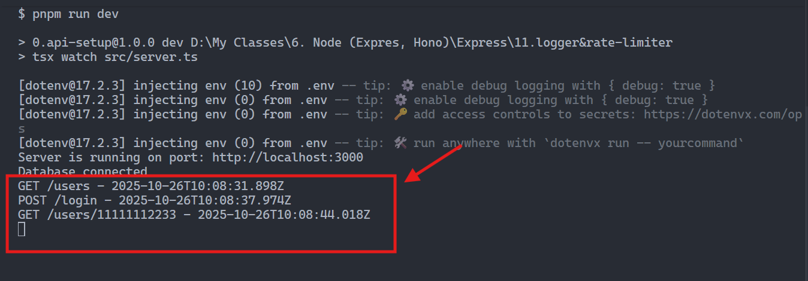

# Express Middleware: Logger and Rate Limiting

This document explains how the **request logger** and **rate limiter** middlewares are implemented and used in this project.

## 1. Overview

Express middleware functions are pieces of code that run **between a request** and  **a response** .

They can modify requests, handle errors, log activity, or even stop requests if necessary.

In this setup, we use two key middlewares:

1. **Logger** – Records incoming requests (useful during development)
2. **Rate Limiter** – Prevents clients from sending too many requests in a short time (basic security)

These tools help improve  **visibility** ,  **security** , and **stability** of your API.

## 2. The Request Logger

**File:** `src/middleware/logger.ts`

```typescript
import { Request, Response, NextFunction } from 'express';

export const logger = (req: Request, res: Response, next: NextFunction) => {
    console.log(`${req.method} ${req.url} - ${new Date().toISOString()}`);
    next();
}


```

### What It Does

* Logs every incoming HTTP request to the console.
* Shows:
  * HTTP method (`GET`, `POST`, etc.)
  * URL endpoint
  * Timestamp (in ISO format)
* Calls `next()` to let the request continue to the next middleware or route.

**Example log:**



### Why It’s Useful

* Helps track incoming requests during development.
* Useful for debugging and auditing request flow.
* Lightweight and easy to understand for beginners.

## 3. Rate Limiting

**File:** `src/middleware/rateLimiter.ts`

```typescript
import { RateLimiterMemory } from "rate-limiter-flexible";
import { NextFunction, Request, Response } from 'express';


export const rateLimiter = new RateLimiterMemory({
    points: 10, // 10 requests
    duration: 60, // per 60 seconds
});

export const rateLimiterMiddleware = async (req: Request, res: Response, next: NextFunction) => {
    try {
        await rateLimiter.consume(req.ip || 'unknown'); // means consume 1 point per request from IP
        console.log(`Rate limit check passed for IP: ${req.ip}`);
        next();
    } catch (error) {
        console.log(`Rate limit exceeded for IP: ${req.ip}`);
        res.status(429).json({ message: 'Too Many Requests, please try again later' });
    }
};
```

### What It Does

* Allows  **10 requests per minute per IP** .
* If a client exceeds that, the server responds with  **HTTP 429 Too Many Requests** .
* Uses the **rate-limiter-flexible** package for implementation.

### Example Behavior

| Request Count | Result  | Description               |
| ------------- | ------- | ------------------------- |
| 1–10         | Allowed | Request passes            |
| 11+           | Blocked | Returns 429 JSON response |

**Response example (blocked):**


### Why It’s Useful

* Protects your API from spam or accidental overuse.
* Prevents simple Denial-of-Service (DoS) attacks.
* Helps maintain server performance.

## 4. Integration in Express

**File:** `src/index.ts`

```typescript
import express from 'express'
import todoRoutes from './router/todo.routes';
import userRoutes from './router/user.routes';
import { logger } from './middleware/logger';
import { rateLimiterMiddleware } from './middleware/rateLimiter';

const initializeApp = () => {
    //create express app
    const app = express();

    //middleware
    app.use(express.json()); //parse json request body
    //logger
    app.use(rateLimiterMiddleware);
    //cors
    app.use(logger);
    //ratelimiter

    //register routes
    todoRoutes(app); //register todo routes
    userRoutes(app); //register user routes

    //default route
    app.get('/', (_, res) => {
        res.send("Hello, express API is running...");
    });

    return app;
}

const app = initializeApp();
export default app;

```

### Important Middleware Order

1. `express.json()` → Parses request body.
2. `rateLimiterMiddleware` → Blocks excessive requests.
3. `logger` → Logs each request (only if not blocked earlier).

You can reverse 2 & 3 if you want **every** request (even blocked ones) logged.

## 5. Installation

Install dependencies using pnpm (or npm/yarn):

```bash
pnpm install rate-limiter-flexible
```
