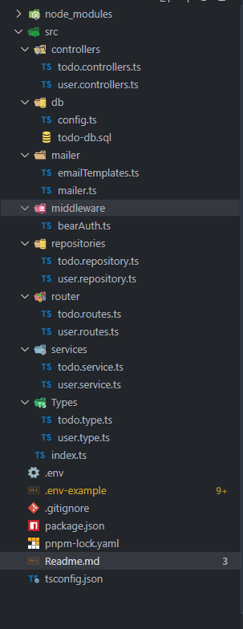

# Email Integration with Nodemailer in Express.js

## Overview

**Nodemailer** is a powerful and flexible Node.js module for sending emails. It supports various email services and provides a clean API for sending both plain text and HTML emails. In modern web applications, email functionality is essential for user registration, password resets, notifications, and user engagement.

This project implements a comprehensive email system using Nodemailer with Gmail SMTP, including email templates, user verification, and various email types throughout the user journey.

### Why Email Integration?

Email functionality serves multiple purposes in web applications:

| Email Type                      | Purpose                         | Real-World Example              |
| ------------------------------- | ------------------------------- | ------------------------------- |
| **Welcome Email**         | User onboarding and engagement  | "Welcome to our platform!"      |
| **Verification Email**    | Account security and validation | "Verify your email address"     |
| **Success Notifications** | User feedback and confirmation  | "Account verified successfully" |
| **Password Reset**        | Account recovery and security   | "Reset your password"           |

This approach makes your application:

- **Professional** (users expect email confirmations)
- **Secure** (email verification prevents fake accounts)
- **Engaging** (keeps users informed and connected)
- **Trustworthy** (proper email flow builds user confidence)

## Implementation Flow

```
1. User registers → Email with verification code sent
2. User enters code → Account verified + success email sent  
3. System events occur → Relevant notifications sent
4. All emails use templates → Consistent branding and format
```

## 1. Installation and Setup

### Installing Nodemailer

First, install Nodemailer and its TypeScript types using pnpm:

```bash
# Install nodemailer and its types
pnpm install nodemailer
pnpm install @types/nodemailer --save-dev
```

**Key Points:**

- `nodemailer` - The main package for sending emails
- `@types/nodemailer` - TypeScript definitions for better development experience
- We use pnpm as our package manager for this project

### Gmail App Password Setup

To use Gmail as your email service, you need to set up an App Password for security. Regular Gmail passwords won't work with SMTP due to security restrictions.

**Steps to create Gmail App Password:**

1. Visit: [https://support.google.com/mail/answer/185833?hl=en](https://support.google.com/mail/answer/185833?hl=en)
2. Sign in to your Google Account
3. Go to Security settings
4. Enable 2-Factor Authentication **(required for App Passwords)**
5. Generate an App Password specifically for this application
6. Copy the 16-character password (it will look like: `abcd efgh ijkl mnop`)

**Important Security Notes:**

- Never use your regular Gmail password in code
- App passwords are more secure and can be revoked individually
- Keep your app password secret and never commit it to version control

### Environment Variables Configuration

Create or update your `.env` file with the following email configuration:

```env
# Mail configuration
SMTP_HOST=smtp.gmail.com
MAIL_USER=your-email@gmail.com
MAIL_PASSWORD=your-16-character-app-password
```

**Environment Variables Explained:**

- `SMTP_HOST` - Gmail's SMTP server address
- `MAIL_USER` - Your Gmail address that will send emails
- `MAIL_PASSWORD` - The 16-character App Password (**NOT your regular Gmail password**)

## 2. Project Structure - Adding Mailer Functionality

In our Express.js project, we organize email functionality in a dedicated `mailer` folder within the `src` directory:



```text
src/
  mailer/
    mailer.ts          # Core email sending functionality
    emailTemplates.ts  # Reusable email templates
```

This organization keeps email-related code modular and maintainable, following the layered architecture pattern used throughout the project.

## 3. Mailer Configuration - Setting Up the Email Service

Create the main email service file `src/mailer/mailer.ts`:

```typescript
import nodemailer from "nodemailer";
import dotenv from "dotenv";

dotenv.config();

export const sendEmail = async (
    to: string,
    subject: string,
    html?: string
): Promise<string> => {
    try {
        const transporter = nodemailer.createTransporter({
            host: process.env.SMTP_HOST,  // Gmail SMTP server
            port: 465,  // SMTP port for Gmail
            service: 'gmail',  // Gmail service
            secure: true, // Use SSL for secure connection
            auth: {
                user: process.env.MAIL_USER,
                pass: process.env.MAIL_PASSWORD
            }
        });

        const mailOptions: nodemailer.SendMailOptions = {
            from: process.env.MAIL_USER,
            to,
            subject,
            html
        };

        const mailRes = await transporter.sendMail(mailOptions);
        console.log("Message sent:", mailRes);

        if (mailRes.accepted.length > 0) return 'Email sent successfully';
        if (mailRes.rejected.length > 0) return 'Email not sent';
        return 'Email server not responding';
    } catch (error: any) {
        console.log("Error sending email:", error.message);
        return JSON.stringify(error.message);
    }
};
```

**Key Components Explained:**

1. **Transporter Configuration**:

   - `host: smtp.gmail.com` - Gmail's SMTP server
   - `port: 465` - Secure SMTP port for Gmail
   - `secure: true` - Uses SSL encryption for security
   - `auth` - Your Gmail credentials (from environment variables)
2. **Mail Options**:

   - `from` - Sender's email address
   - `to` - Recipient's email address
   - `subject` - Email subject line
   - `html` - HTML content of the email
3. **Error Handling**:

   - Returns success/failure status
   - Logs detailed error information
   - Handles different response scenarios

## 4. Basic Email Sending - Welcome Email Implementation

Now let's integrate email sending into our user registration process. In the user service (`src/services/user.service.ts`), we add email functionality to the `createUser` function:

```typescript
import { sendEmail } from '../mailer/mailer';

export const createUser = async (user: NewUser) => {
    // 1. Hash the password before saving
    if (user.password) {
        user.password = await bcrypt.hash(user.password, 10);
    }

    // 2. Save the user to database
    const result = await userRepositories.createUser(user);

    // 3. Send welcome email to the user
    try {
        await sendEmail(
            user.email,
            'Welcome to Todo App By Kemboi',
            `<div>
            <h2>Welcome ${user.first_name}!</h2>
            <p>Thank you for registering with our Todo App. We're excited to have you on board!</p>
            <P>You can now log in and start managing your tasks efficiently.</P>
            </div>`,
        );
    } catch (error) {
        console.error('Error sending welcome email:', error);
    }

    return result;
}
```

**Implementation Flow:**

1. **User Registration Process**:

   - Hash password for security
   - Save user data to database
   - Send welcome email immediately after successful registration
2. **Email Content Structure**:

   - Personalized greeting using `${user.first_name}`
   - Clear welcome message
   - Brief instructions or next steps
   - HTML formatting for better presentation
3. **Error Handling**:

   - Email sending is wrapped in try-catch
   - Registration succeeds even if email fails
   - Errors are logged for debugging purposes

**Important Notes:**

- Email sending doesn't block user registration
- If email fails, the user account is still created
- This prevents email issues from breaking the registration flow

## 5. Email Template System - Making Emails Manageable

As your application grows, having inline HTML in your service files becomes difficult to maintain. Let's create a dedicated email template system in `src/mailer/emailTemplates.ts`:

```typescript
export const emailTemplate = {
    welcome: (firstName: string) => `
    <div>
        <h2>Welcome ${firstName}!</h2>
        <p>Thank you for registering with our Todo App. We're excited to have you on board!</p>
        <P>You can now log in and start managing your tasks efficiently.</P>
    </div>
    `,
  
    verify: (firstName: string, code: string) => `
    <div style="font-family: Arial, sans-serif; color: #333;">
        <h2>Hello ${firstName}!</h2>
        <p>Your verification code is: <strong>${code}</strong></p>
        <p>Please enter this code in the app to verify your email address.</p>
        <br />
        <p> Thank you,<br/>The Todo App Team</p>
    </div>
    `,
  
    verifiedSuccess: (firstName: string) => `
    <div style="font-family: Arial, sans-serif; color: #333;">
      <h2>Hello ${firstName},</h2>
      <p> Your account has been verified successfully!</p>
      <p>You can now log in and start using all features.</p>
      <br/>
      <p> Thank you,<br/>The Todo App Team</p>
    </div>
    `
};
```

### Refactoring to Use Email Templates

Now we can update our user service to use these templates instead of inline HTML:

```typescript
import { emailTemplate } from '../mailer/emailTemplates';

export const createUser = async (user: NewUser) => {
    // 1. Hash password and save user (same as before)
    if (user.password) {
        user.password = await bcrypt.hash(user.password, 10);
    }
    const result = await userRepositories.createUser(user);

    // 2. Send welcome email using template
    await sendEmail(
        user.email,
        'Welcome to Todo App By Kemboi',
        emailTemplate.welcome(user.first_name),
    );

    return result;
}
```

**Benefits of Email Templates:**

1. **Maintainability**: All email content in one organized file
2. **Consistency**: Uniform styling and branding across all emails
3. **Reusability**: Templates can be used in multiple places
4. **Separation of Concerns**: Business logic separate from presentation
5. **Easy Updates**: Change email design without touching service code

**Template Structure:**

- Each template is a function that accepts dynamic parameters
- Returns HTML string with proper styling
- Includes consistent branding and formatting
- Can be easily extended with new email types

## 6. Email Verification System - Enhanced Security

To add email verification functionality, we need to extend our database schema and implement a verification workflow.

### Database Schema Updates

Add verification fields to the Users table:

```sql
-- Add verification columns to existing Users table
ALTER TABLE Users
ADD verification_code VARCHAR(10),
    is_verified BIT DEFAULT 0;
```

**Schema Changes Explained:**

- `verification_code VARCHAR(10)` - Stores the 6-digit verification code
- `is_verified BIT DEFAULT 0` - Boolean flag (0 = not verified, 1 = verified)
- New users start as unverified (`is_verified = 0`)

### Complete Verification Workflow

The verification system works in three main steps:

1. **Registration**: Send verification code via email
2. **Verification**: User enters code to verify their account
3. **Confirmation**: Send success email when verified

```sql
-- Updated Users table structure
CREATE TABLE Users (
    userid INT IDENTITY(1,1) PRIMARY KEY,
    first_name VARCHAR(40) NOT NULL,
    last_name VARCHAR(40) NOT NULL,
    email VARCHAR(100) UNIQUE NOT NULL,
    phone_number VARCHAR(15),
    password VARCHAR(MAX) NOT NULL,
    role VARCHAR(20) DEFAULT 'user',
    verification_code VARCHAR(10),
    is_verified BIT DEFAULT 0
);
```

**Security Benefits:**

- Prevents registration with fake email addresses
- Ensures users have access to their registered email
- Adds an extra layer of account security
- Helps prevent spam and automated registrations

## 7. Implementation Across Application Layers

### Repository Layer - Database Operations

Update `src/repositories/user.repository.ts` with verification functions:

```typescript
// Set verification code for a user
export const setVerificationCode = async (email: string, code: string) => {
    const pool = await getPool();
    await pool
        .request()
        .input('email', email)
        .input('code', code)
        .query('UPDATE Users SET verification_code = @code, is_verified = 0 WHERE email = @email');
    return { message: 'Verification code saved' };
}

// Verify user by setting is_verified to true
export const verifyUser = async (email: string) => {
    const pool = await getPool();
    await pool
        .request()
        .input('email', email)
        .query('UPDATE Users SET is_verified = 1, verification_code = NULL WHERE email = @email');
    return { message: 'User verified successfully' };
};

// Get user by email - used for verification lookup
export const getUserByEmail = async (email: string): Promise<User | null> => {
    const pool = await getPool();
    const result = await pool
        .request()
        .input('email', email)
        .query('SELECT * FROM Users WHERE email = @email');
    return result.recordset[0] || null;
}
```

### Service Layer - Business Logic

Update `src/services/user.service.ts` with complete verification workflow:

```typescript
export const createUser = async (user: NewUser) => {
    // 1. Hash password
    if (user.password) {
        user.password = await bcrypt.hash(user.password, 10);
    }

    // 2. Generate 6-digit verification code
    const verificationCode = Math.floor(100000 + Math.random() * 900000).toString();
  
    // 3. Save user to database
    const result = await userRepositories.createUser(user);
  
    // 4. Save verification code
    await userRepositories.setVerificationCode(user.email, verificationCode);

    // 5. Send verification email (not welcome email)
    await sendEmail(
        user.email,
        'Verify your email for Todo App',
        emailTemplate.verify(user.first_name, verificationCode)
    );

    return { message: 'User created successfully. Verification code sent to email' };
}

// Verify user email with code
export const verifyUser = async (email: string, code: string) => {
    const user = await userRepositories.getUserByEmail(email);
    if (!user) {
        throw new Error('User not found');
    }

    if (user.verification_code !== code) {
        throw new Error('Invalid verification code');
    }

    // Mark user as verified
    await userRepositories.verifyUser(email);

    // Send success notification
    await sendEmail(
        user.email,
        'Your email has been verified - Todo App',
        emailTemplate.verifiedSuccess(user.first_name)
    );

    return { message: 'User verified successfully' };
}
```

### Controller Layer - Request Handling

Add verification controller in `src/controllers/user.controllers.ts`:

```typescript
export const verifyUser = async (req: Request, res: Response) => {
    try {
        const { email, code } = req.body;
    
        if (!email || !code) {
            return res.status(400).json({ message: 'Email and verification code are required' });
        }

        const result = await userService.verifyUser(email, code);
        res.status(200).json(result);
    } catch (error: any) {
        res.status(400).json({ message: error.message });
    }
};
```

### Routes Layer - API Endpoints

Add verification route in `src/router/user.routes.ts`:

```typescript
import * as userController from "../controllers/user.controllers";

const userRoutes = (app: Express) => {
    // Existing routes
    app.post("/users", userController.createUser);
    app.post("/login", userController.loginUser);
  
    // New verification route
    app.post("/verify", userController.verifyUser);
}
```

**Complete Flow Example:**

1. **User Registration**:

   ```bash
   POST /users
   {
     "first_name": "John",
     "last_name": "Doe", 
     "email": "john@example.com",
     "password": "mypassword"
   }
   # Response: User created, verification code sent to email
   ```
2. **Email Verification**:

   ```bash
   POST /verify
   {
     "email": "john@example.com",
     "code": "123456"
   }
   # Response: User verified successfully
   ```
3. **Email Timeline**:

   - Registration → Verification code email sent
   - User enters code → Success confirmation email sent
   - User can now log in with verified account

## 8. Best Practices and Security Considerations

### Email Security Best Practices

1. **Environment Variables**: Always store email credentials in environment variables, never in code
2. **App Passwords**: Use Gmail App Passwords instead of regular passwords for enhanced security
3. **Error Handling**: Don't let email failures break critical user workflows
4. **Rate Limiting**: Implement rate limiting on email sending to prevent abuse
5. **Template Validation**: Sanitize user input in email templates to prevent injection attacks

### Code Organization Best Practices

1. **Separation of Concerns**: Keep email logic separate from business logic
2. **Reusable Templates**: Create modular email templates for consistency
3. **Async Operations**: Always handle email sending asynchronously
4. **Logging**: Log email operations for debugging and monitoring

## . Complete Integration Example

Here's how all the pieces work together in a real user journey:

```text
User Registration Flow with Email Verification:

1. POST /users (User registers)
   ↓
2. Hash password + Generate verification code
   ↓  
3. Save user to database (is_verified = 0)
   ↓
4. Send verification email with 6-digit code
   ↓
5. User receives email and enters code
   ↓
6. POST /verify (User submits email + code)
   ↓
7. Validate code against database
   ↓
8. Update user (is_verified = 1, clear verification_code)
   ↓
9. Send success confirmation email
   ↓
10. User can now log in with verified account
```

This comprehensive email system provides a professional user experience while maintaining security and code maintainability. The layered architecture ensures that email functionality is properly separated and can be easily extended or modified as your application grows.
