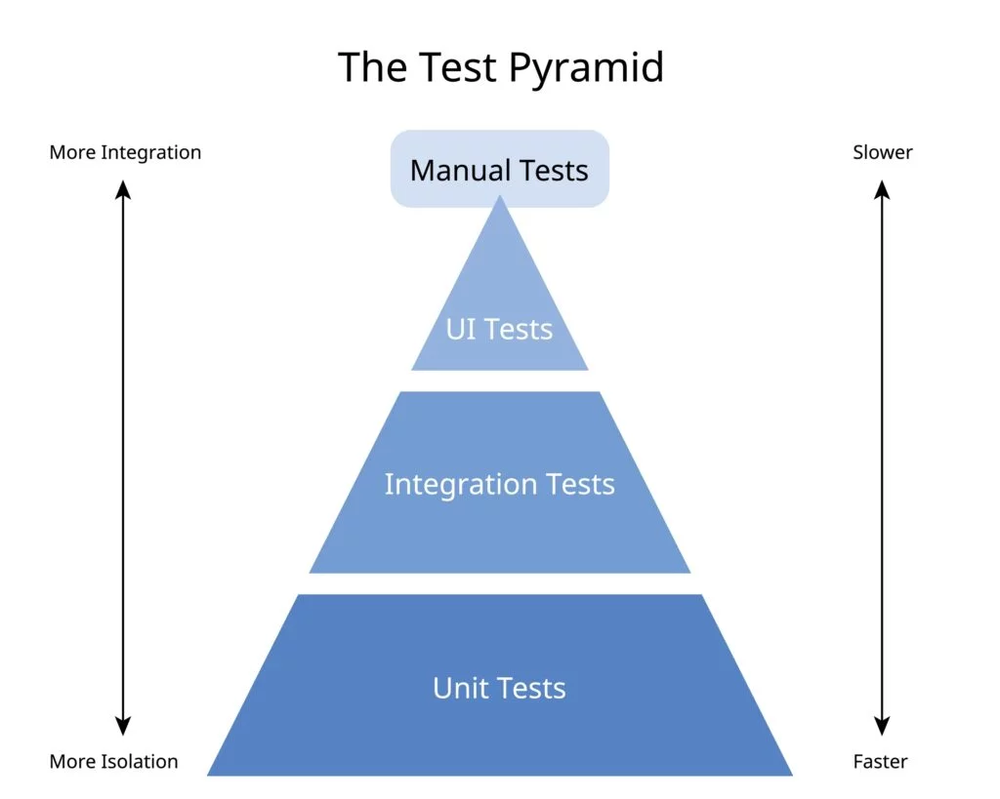
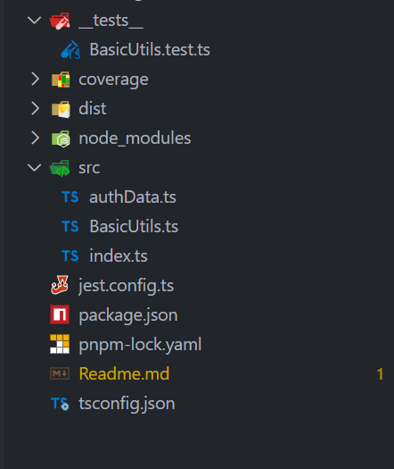
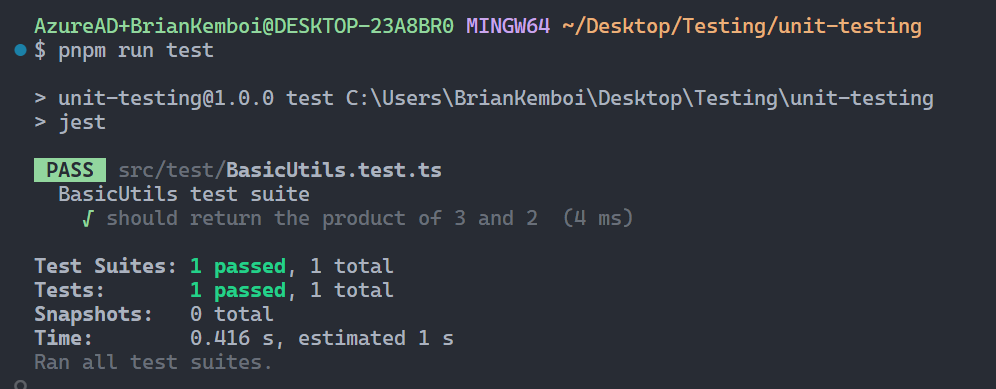

# Unit Testing with Jest in TypeScript

## Overview

**Unit Testing** is the practice of testing individual units of source code to ensure they work as expected. **Jest** is a powerful JavaScript testing framework created by Facebook that works seamlessly with TypeScript, Node.js, React, and other modern JavaScript frameworks. It provides an all-in-one solution with test running, assertion library, mocking capabilities, and code coverage reporting.

In modern software development, unit testing is essential for maintaining code quality, preventing bugs, and ensuring reliable applications. This project demonstrates comprehensive unit testing practices using Jest with TypeScript, covering everything from basic test setup to advanced testing patterns.

### Why Unit Testing?

Unit testing serves multiple purposes in software development:

| Benefit                      | Purpose                             | Real-World Impact                    |
| ---------------------------- | ----------------------------------- | ------------------------------------ |
| **Bug Prevention**     | Catch errors before production      | Reduced customer complaints          |
| **Code Quality**       | Ensure functions work as intended   | More maintainable codebase           |
| **Documentation**      | Tests serve as living documentation | Easier onboarding for new developers |
| **Refactoring Safety** | Confident code changes              | Faster development cycles            |
| **Cost Reduction**     | Fix bugs early in development       | Lower maintenance costs              |

This approach makes your codebase:

- **Reliable** (tests catch regressions before they reach users)
- **Maintainable** (tests document expected behavior)
- **Professional** (industry standard practice)
- **Scalable** (safe to make changes and additions)

## 1. What is Unit Testing?

Unit testing is the process of evaluating and verifying that individual units of source code work correctly. A "unit" is the smallest testable part of an application, typically:

- **Functions** - Individual functions or methods
- **Classes** - Class methods and properties
- **Modules** - Module exports and functionality
- **Components** - In frameworks like React

### Types of Testing (Testing Pyramid)



- **Unit Tests**: Test individual functions/methods in isolation
- **Integration Tests**: Test how different units work together
- **End-to-End Tests**: Test complete user workflows

## 2. What is Jest?

Jest is a comprehensive JavaScript testing framework with the following features:

- **Zero Configuration** - Works out of the box for most JavaScript projects
- **Built-in Test Runner** - No need for additional test runners
- **Powerful Matchers** - Rich assertion library with descriptive error messages
- **Mocking Support** - Built-in mocking capabilities for dependencies
- **Code Coverage** - Integrated coverage reporting
- **Parallel Testing** - Runs tests in parallel for faster execution

### Key Jest Concepts

- **Test Suites** - Groups of related tests (`describe` blocks)
- **Test Cases** - Individual tests (`test` or `it` functions)
- **Matchers** - Assertions that verify expected behavior (`expect().toBe()`)
- **Hooks** - Setup and teardown functions (`beforeEach`, `afterEach`)

## 3. Project Setup

### Step 1: Initialize TypeScript Project

First, set up a TypeScript project with the necessary configuration:

```bash
# Initialize project
npm init -y

# Install TypeScript and build tools
pnpm install -D typescript tsx ts-node
pnpm install -D @types/node

# Initialize TypeScript configuration
npx tsc --init
```

### Step 2: Install Jest Dependencies

Install Jest along with TypeScript support:

```bash
# Install Jest with TypeScript support
pnpm install -D jest ts-jest @types/jest
```

**Package Descriptions:**

- `jest` - The main Jest testing framework
- `ts-jest` - TypeScript preprocessor for Jest
- `@types/jest` - TypeScript definitions for Jest APIs

### Step 3: Configure TypeScript

Update `tsconfig.json` for optimal TypeScript configuration:

```json
{
  "compilerOptions": {
    "target": "ES2022",
    "module": "nodenext",
    "rootDir": "./src",
    "moduleResolution": "nodenext",
    "isolatedModules": true,
    "outDir": "./dist",
    "esModuleInterop": true,
    "forceConsistentCasingInFileNames": true,
    "strict": true,
    "skipLibCheck": true
  },
  "include": [
    "src/**/*"
  ],
  "exclude": [
    "node_modules",
    "**/*.spec.ts"
  ]
}
```

**Key Configuration Options:**

- `strict: true` - Enables all strict type checking options
- `isolatedModules: true` - Ensures each file can be transpiled independently
- `esModuleInterop: true` - Enables interoperability between ES modules and CommonJS

### Step 4: Configure Jest

Create `jest.config.ts` in the project root:

```typescript
import { Config } from "jest"

const config: Config = {
    preset: "ts-jest", // Uses ts-jest for TypeScript support
    testEnvironment: "node", // Specifies the environment for tests
    verbose: true, // Shows individual test results

    // Coverage Configuration
    collectCoverage: true, // Enables code coverage collection
    coverageDirectory: "coverage", // Output directory for coverage reports
    collectCoverageFrom: [
        '<rootDir>/src/**/*.ts' // Files to include for coverage
    ]
}

export default config
```

**Configuration Explained:**

- `preset: "ts-jest"` - Uses ts-jest preset for TypeScript compilation
- `testEnvironment: "node"` - Sets Node.js environment (vs browser environment)
- `verbose: true` - Provides detailed test output
- `collectCoverage: true` - Generates code coverage reports

### Step 5: Update Package Scripts

Add test scripts to `package.json`:

```json
{
  "name": "7.fundamentals-unit-testing",
  "version": "1.0.0",
  "scripts": {
    "dev": "tsx watch src/index.ts",
    "build": "tsc",
    "start": "npm run build && node dist/index.js",
    "test": "jest"
  },
  "devDependencies": {
    "@types/jest": "^30.0.0",
    "jest": "^30.2.0",
    "ts-jest": "^29.4.5",
    "ts-node": "^10.9.2",
    "tsx": "^4.20.6",
    "typescript": "^5.9.3"
  }
}
```

### Step 6: Project Structure

Organize your project with a clear structure:



## 4. Writing Your First Test

### Creating the Function to Test

Create `src/BasicUtils.ts` with a simple function:

```typescript
export function product(a: number, b: number): number {
    return a * b;
}
```

### Writing the Test

Create `__tests__/BasicUtils.test.ts`:

```typescript
import { product } from "../src/BasicUtils";

describe("BasicUtils test suite", () => {
    test("should return the product of two positive numbers", () => {
        const actual = product(3, 4);
        const expected = 12;
        expect(actual).toBe(expected);
    });
});
```

### Running Your First Test

Execute the test using the npm script:

```bash
pnpm run test
```

**Expected Output:**


## 5. Jest Matchers - Assertion Methods

Jest provides a rich set of matchers for different types of assertions:

### Common Matchers

```typescript
describe("Jest Matchers Examples", () => {
    it("should demonstrate various matchers", () => {
        const actual = product(3, 2);
  
        // Equality matchers
        expect(actual).toBe(6);           // Strict equality (===)
        expect(actual).toEqual(6);        // Deep equality
        expect(actual).not.toBe(7);       // Negation
  
        // Numeric matchers
        expect(actual).toBeLessThan(10);
        expect(actual).toBeLessThanOrEqual(6);
        expect(actual).toBeGreaterThan(5);
        expect(actual).toBeGreaterThanOrEqual(6);
        expect(actual).toBeCloseTo(6.0);  // Floating point comparison
  
        // Truthiness matchers
        expect(actual).toBeTruthy();      // Truthy values
        expect(0).toBeFalsy();            // Falsy values
        expect(actual).toBeDefined();     // Not undefined
        expect(undefined).toBeUndefined(); // Is undefined
        expect(null).toBeNull();          // Is null
    });
});
```

### Array and Object Matchers

```typescript
it("should work with arrays and objects", () => {
    const array = ["a", "b", "c"];
    const obj = { name: "John", age: 30 };
  
    // Array matchers
    expect(array).toContain("b");
    expect(array).toEqual(expect.arrayContaining(["a", "c"]));
    expect(array).toHaveLength(3);
  
    // Object matchers
    expect(obj).toEqual({ name: "John", age: 30 });
    expect(obj).toMatchObject({ name: "John" });
    expect(obj).toHaveProperty("name");
    expect(obj).toHaveProperty("name", "John");
});
```

## 6. The AAA Pattern - Structured Test Writing

A well-written unit test should follow the **AAA pattern**:

### AAA Pattern Explained

- **A**rrange - Set up the test data and conditions
- **A**ct - Execute the function or method being tested
- **A**ssert - Verify the results match expectations

### Example: Testing User Authentication

First, create the interface and function:

```typescript
// src/authData.ts
export interface IAuthData {
    usernameToLower: string;
    usernameCharacters: string[];
    userDetails: Object | undefined;
    isAuthenticated: boolean;
}

// src/BasicUtils.ts
import { IAuthData } from "./authData";

export function authenticateUser(username: string, password: string): IAuthData {
    // Simulate authentication logic
    const authStatus = username === "deveLOPER" && password === "dev";
    return {
        usernameToLower: username.toLowerCase(),
        usernameCharacters: username.split(""),
        userDetails: { name: "Developer", role: "admin" },
        isAuthenticated: authStatus
    };
}
```

### AAA Pattern in Practice

```typescript
it("user authentication test", () => {
    // ARRANGE - Set up test data and system under test
    const sut = authenticateUser; // System Under Test
    const testUsername = "deveLOPER";
    const testPassword = "dev";
  
    // ACT - Execute the function being tested
    const actual = sut(testUsername, testPassword);
  
    // ASSERT - Verify the results
    expect(actual.usernameToLower).toBe("developer");
    expect(actual.usernameCharacters).toEqual(["d", "e", "v", "e", "L", "O", "P", "E", "R"]);
    expect(actual.userDetails).toEqual({ name: "Developer", role: "admin" });
    expect(actual.isAuthenticated).toBeTruthy();
});
```

### Benefits of AAA Pattern

1. **Clarity** - Makes test structure obvious
2. **Maintainability** - Easy to modify individual sections
3. **Readability** - Other developers can quickly understand the test
4. **Debugging** - Easy to identify which phase is failing

### AAA Pattern Best Practices

```typescript
it("should handle edge cases properly", () => {
    // ARRANGE - Clear setup with descriptive variable names
    const invalidUsername = "";
    const validPassword = "dev";
    const expectedErrorMessage = "Username cannot be empty";
  
    // ACT - Single action being tested
    const action = () => UserNameToLowerCase(invalidUsername);
  
    // ASSERT - Clear expectations
    expect(action).toThrow(expectedErrorMessage);
});
```

## 7. FIRST-U Principles - Writing Quality Tests

To write maintainable and effective unit tests, follow the **FIRST-U** principles:

### F - Fast

Tests should execute quickly to encourage frequent running.

```typescript
// Good - Fast test
it("should calculate product quickly", () => {
    expect(product(5, 4)).toBe(20);
});

// Bad - Slow test (avoid database calls, file I/O)
it("should save user to database", async () => {
    await database.connect(); // Slow operation
    // ... database operations
});
```

### I - Independent/Isolated

Tests should not depend on other tests or external state.

```typescript
// Good - Independent tests
describe("User Authentication Tests", () => {
    it("should convert username to lowercase", () => {
        const sut = authenticateUser;
        const actual = sut("deveLOPER", "dev");
        expect(actual.usernameToLower).toBe("developer");
    });

    it("should split username into characters array", () => {
        const sut = authenticateUser;
        const actual = sut("deveLOPER", "dev");
        expect(actual.usernameCharacters).toEqual(["d", "e", "v", "e", "L", "O", "P", "E", "R"]);
    });
});
```

### R - Repeatable

Tests should produce the same results every time they run.

```typescript
// Good - Repeatable test
it("should always return same result for same input", () => {
    expect(product(3, 4)).toBe(12);
    expect(product(3, 4)).toBe(12); // Same result every time
});

// Bad - Non-repeatable (depends on current time)
it("should return current timestamp", () => {
    expect(getCurrentTimestamp()).toBe(Date.now()); // Will fail
});
```

### S - Self-Validating

Tests should have a clear pass/fail result without manual interpretation.

```typescript
// Good - Clear pass/fail
it("should authenticate valid user", () => {
    const actual = authenticateUser("deveLOPER", "dev");
    expect(actual.isAuthenticated).toBeTruthy(); // Clear assertion
});

// Bad - Requires manual interpretation
it("should process user data", () => {
    const result = authenticateUser("deveLOPER", "dev");
    console.log(result); // Manual verification required
});
```

### T - Timely

Tests should be written at the appropriate time (ideally with or before the code).

```typescript
// Good - Test written with the feature
describe("New Feature: Password Validation", () => {
    it("should validate password strength", () => {
        expect(validatePassword("StrongPass123!")).toBe(true);
    });
});
```

### U - Understandable/Unique

Tests should be clear and easy to understand/Unique.

```typescript
// Good - Clear and understandable
it("should contain specific characters in username array", () => {
    const sut = authenticateUser;
    const actual = sut("deveLOPER", "dev");
  
    expect(actual.usernameCharacters).toEqual(
        expect.arrayContaining(['L', 'O', 'P'])
    );
});

// Bad - Unclear purpose
it("should work correctly", () => {
    const result = authenticateUser("deveLOPER", "dev");
    expect(result.usernameCharacters).toEqual(expect.arrayContaining(['L', 'O', 'P']));
});
```

## 8. Advanced Testing Patterns

### Parameterized Tests

Test multiple scenarios with the same logic:

```typescript
describe("Parameterized Tests", () => {
    test.each([
        [3, 4, 12],
        [5, 6, 30],
        [7, 8, 56],
        [2, 9, 18]
    ])("product(%i, %i) should return %i", (a, b, expected) => {
        expect(product(a, b)).toBe(expected);
    });

    it.each([
        ["deveLOPER", "developer"],
        ["KEMBOI", "kemboi"],
        ["JOHNDOE", "johndoe"],
        ["JaneDoe", "janedoe"]
    ])("UserNameToLowerCase(%s) should return %s", (input, expected) => {
        expect(UserNameToLowerCase(input)).toBe(expected);
    });
});
```

### Jest Hooks for Setup and Teardown

```typescript
describe("Jest Hooks Example", () => {
    let username: string;

    beforeAll(() => {
        console.log("Starting test suite...");
        // One-time setup for all tests
    });

    beforeEach(() => {
        // Setup before each test
        username = "deveLOPER";
        console.log("Username value:", username);
    });

    afterEach(() => {
        // Cleanup after each test
        username = "";
        console.log("Username cleared:", username);
    });

    afterAll(() => {
        console.log("Finished test suite.");
        // One-time cleanup after all tests
    });

    test("converts username to lowercase", () => {
        expect(UserNameToLowerCase(username)).toBe("developer");
    });
});
```

### Testing Error Conditions

```typescript
export function UserNameToLowerCase(username: string): string {
    if (username === "") {
        throw new Error("Username cannot be empty");
    }
    return username.toLowerCase();
}

// Test the error condition
it("should throw error for empty username", () => {
    expect(() => UserNameToLowerCase("")).toThrow("Username cannot be empty");
});
```

## 9. Code Coverage

Jest automatically generates code coverage reports when configured:

### Understanding Coverage Metrics

- **Statements** - Percentage of code statements executed
- **Branches** - Percentage of code branches (if/else) taken
- **Functions** - Percentage of functions called
- **Lines** - Percentage of code lines executed

### Coverage Reports

Run tests with coverage:

```bash
pnpm run test
```

Coverage reports are generated in the `coverage/` directory:

- `coverage/lcov-report/index.html` - Interactive HTML report
- `coverage/lcov.info` - LCOV format for CI/CD integration

### Ignoring Code from Coverage

Use Istanbul comments to exclude code:

```typescript
/* istanbul ignore next */
function debugFunction() {
    console.log("Debug information");
}
```

## 10. Best Practices

### Descriptive Test Names

```typescript
// Good - Descriptive names
it("should return true when username is 'deveLOPER' and password is 'dev'", () => {});
it("should throw error when username is empty string", () => {});
it("should convert uppercase username to lowercase", () => {});

// Bad - Vague names
it("should work", () => {});
it("should test authentication", () => {});
it("should return something", () => {});
```

## Conclusion

Unit testing with Jest provides a robust foundation for building reliable TypeScript applications. By following the AAA pattern and FIRST-U principles, you can create maintainable test suites that catch bugs early and document your code's behavior.

Key takeaways:

- **Start simple** with basic test cases and gradually add complexity
- **Follow patterns** like AAA and FIRST-U for consistent, quality tests
- **Use descriptive names** to make tests serve as documentation
- **Organize tests logically** with nested describe blocks
- **Aim for good coverage** but focus on testing important behaviors

Remember: Good tests are an investment in your codebase's future. They save time by catching bugs early and give you confidence to refactor and extend your code safely.
