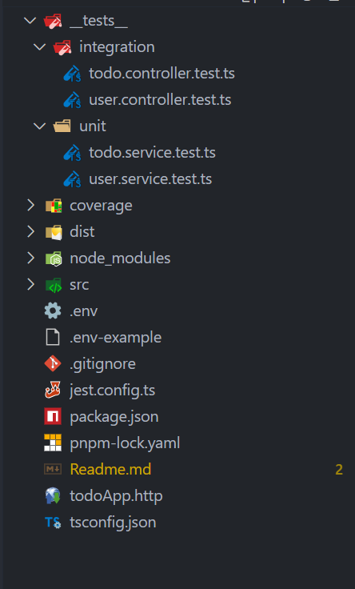

# Integration Testing with Supertest ## Overview

**Integration Testing** is a level of software testing where individual modules are combined and tested as a group. Unlike  **unit tests** , which test isolated components, integration tests verify that multiple parts of the application work together correctly.

In Node.js applications, **Supertest** is commonly used to perform HTTP-based integration tests, allowing you to send real requests to your API endpoints and verify their responses.

Integration testing ensures that:

* Modules communicate correctly
* External dependencies behave as expected
* API endpoints respond as designed
* Database operations are executed properly
* The end-to-end request–response cycle functions as intended

## Testing Pyramid Revisited

| Test Type                   | Scope                | Speed  | Cost   | Confidence |
| --------------------------- | -------------------- | ------ | ------ | ---------- |
| **Unit Tests**        | Individual functions | Fast   | Low    | Medium     |
| **Integration Tests** | Combined components  | Medium | Medium | High       |
| **End-to-End Tests**  | Full workflows       | Slow   | High   | Highest    |

Integration tests form the **middle layer** of the testing pyramid, providing a balance between speed, confidence, and coverage.

## 1. What Is Integration Testing?

Integration testing verifies the **interaction between multiple parts** of an application to ensure they function as expected when combined.

In a web application, integration testing often includes:

* **API Endpoint Testing** – Testing HTTP routes and response behavior
* **Database Integration** – Verifying persistence, retrieval, and data integrity
* **Service Layer Testing** – Ensuring service and repository layers interact correctly
* **Middleware Testing** – Verifying middleware like authentication or validation
* **External API Integration** – Testing interactions with third-party APIs

Integration tests often hit a  **real or test database** , simulating real-world use cases.

## 2. What Is Supertest?

**Supertest** is a Node.js library built on top of  **Superagent** , designed specifically for testing HTTP servers. It provides a simple and expressive API to make requests and assert responses, often paired with testing frameworks like **Jest** or  **Mocha** .

### Installation

```bash
pnpm install -D supertest @types/supertest
```

### Key Features

* **HTTP Testing** — Send real HTTP requests to your app
* **Framework Agnostic** — Works with Express, Fastify, Koa, etc.
* **Rich Assertions** — Built-in methods for response validation
* **Async/Await Support** — Works seamlessly with modern async code

## 3. Core Supertest Concepts

### Making HTTP Requests

Supertest supports all standard HTTP methods:

```typescript
import request from 'supertest';
import app from '../src/app';

// GET request
await request(app).get('/api/users');

// POST request
await request(app).post('/api/users').send(userData);

// PUT request
await request(app).put('/api/users/1').send(updateData);

// DELETE request
await request(app).delete('/api/users/1');

```

### Configuring Requests

You can customize request headers, authorization tokens, and payloads:

```typescript
await request(app)
  .post('/api/users')
  .set('Content-Type', 'application/json')
  .set('Authorization', 'Bearer token')
  .send({ name: 'John', email: 'john@example.com' })
  .expect(201);

```

### Validating Responses

Supertest allows flexible and expressive assertions:

```typescript
const response = await request(app)
  .get('/api/users/1')
  .expect(200)
  .expect('Content-Type', /json/)
  .expect(res => {
    if (!res.body.name) throw new Error('Missing name');
  });

// Custom Jest assertions
expect(response.body.name).toBe('John');
expect(response.headers['content-type']).toMatch(/json/);

```

## 4. Database Integration in Tests

When testing APIs that interact with a database:

1. **Use a Test Database** – Separate from production.
2. **Seed Test Data** – Insert required records before tests run.
3. **Clean Up After Tests** – Remove test data in `afterAll` hooks.
4. **Use Transactions (Optional)** – Roll back changes after each test for faster cleanup.
5. **Prefer Parameterized Queries** – Avoid SQL injection even in tests.

Example:

```typescript
const pool = await getPool();
await pool.request()
  .input('email', 'test@example.com')
  .input('password', 'hashed')
  .query('INSERT INTO Users (email, password) VALUES (@email, @password)');

```

## 5. Integration Testing vs Unit Testing

| Aspect                      | Unit Testing           | Integration Testing   |
| --------------------------- | ---------------------- | --------------------- |
| **Scope**             | Single function/method | Multiple modules      |
| **Dependencies**      | Mocked/stubbed         | Real or partial mocks |
| **Speed**             | Very fast              | Slower                |
| **Setup Complexity**  | Minimal                | Requires environment  |
| **Isolation**         | Fully isolated         | Interdependent        |
| **Confidence Level**  | Lower                  | Higher                |
| **Failure Diagnosis** | Easy                   | More complex          |

### When to Use Each

**Use Unit Tests for:**

* Business logic and calculations
* Utility functions and helpers
* Edge case handling

**Use Integration Tests for:**

* API route validation
* Database CRUD operations
* Authentication and authorization flows
* Service-to-repository interactions


# Integration Testing Practical Guide - Todo API

## Overview

This project demonstrates integration testing for a Node.js Express Todo API using Jest and Supertest. We test the complete request-response cycle including database operations and error handling.

## What We're Testing

Our Todo API handles basic CRUD operations with proper validation and error responses.

## API Endpoints Tested

| Method | Endpoint       | Purpose           | Test Cases                     |
| ------ | -------------- | ----------------- | ------------------------------ |
| GET    | `/todos`     | List all todos    | Success, empty list            |
| GET    | `/todos/:id` | Get specific todo | Success, not found             |
| POST   | `/todos`     | Create todo       | Success, validation errors     |
| PUT    | `/todos/:id` | Update todo       | Success, not found, invalid ID |
| DELETE | `/todos/:id` | Delete todo       | Success, not found, invalid ID |

## Folder Structure



## Test Setup Strategy

Our integration tests follow a simple but effective approach:

### Database Management

- Create a unique test user for each test run to avoid conflicts
- Use helper functions to insert test data consistently
- Clean up all test data after tests complete
- Respect foreign key constraints during cleanup

### Key Test Setup Code

```typescript
// Create unique user to prevent conflicts
const uniqueEmail = `todo_integration_${Date.now()}@testmail.com`;

// Helper function for consistent test data
const insertTodo = async (name: string, userId: number) => {
  // Insert todo and return the ID for testing
  return result.recordset[0].todoid;
};
```

## Main Testing Patterns

### 1. CRUD Operation Tests

We test each operation with both success and failure scenarios:

**Create Todo**

```typescript
it("should create a new todo successfully", async () => {
  const todoData = { todo_name: "Test Todo", user_id: testUserId };
  
  const res = await request(app)
    .post("/todos")
    .send(todoData);
  
  expect(res.status).toBe(201);
});
```

**Read Todo**

```typescript
it("should fetch a todo by ID", async () => {
  const todoId = await insertTodo("Test Todo", testUserId);
  
  const res = await request(app).get(`/todos/${todoId}`);
  
  expect(res.status).toBe(200);
  expect(res.body.todo_name).toMatch(/Test Todo/i);
});
```

### 2. Error Handling Tests

We verify proper error responses for invalid requests:

```typescript
// Test 404 for non-existent resource
it("should return 404 for non-existent todo", async () => {
  const res = await request(app).get("/todos/999999");
  expect(res.status).toBe(404);
});

// Test 400 for invalid input
it("should return 400 for invalid ID", async () => {
  const res = await request(app).put("/todos/abc");
  expect(res.status).toBe(400);
});
```

## Why This Approach Works

### Controller Design

Our controllers properly delegate to service layers and handle errors:

```typescript
export const getTodos = async (req: Request, res: Response) => {
    try {
        const todos = await todoServices.listTodos(); // Delegate to service
        res.status(200).json(todos);
    } catch (error: any) {
        res.status(500).json({ error: error.message }); // Handle errors
    }
}
```

### Service Layer Validation

Business logic validation happens in the service layer:

```typescript
export const updateTodo = async (id: number, todo: UpdateTodo) => {
    const existingTodo = await todoRepositories.getTodoById(id);
    if (!existingTodo) {
        throw new Error('Todo not found'); // Clear error for controller
    }
    return await todoRepositories.updateTodo(id, todo);
}
```

## Running the Tests

```bash
# Run all tests
npm test

# Run only integration tests
npm test __tests__/integration

# Run with coverage
npm run test:coverage
```

## Key Benefits

This integration testing approach provides:

- **Real HTTP Testing** - Tests actual API endpoints
- **Database Integration** - Verifies data persistence works
- **Error Validation** - Ensures proper error handling
- **Confidence** - Catches issues that unit tests miss
- **Documentation** - Tests show how the API should behave

## Best Practices Demonstrated

1. **Test Isolation** - Each test has its own data
2. **Helper Functions** - Reduce code duplication
3. **Error Coverage** - Test both success and failure paths
4. **Clean Architecture** - Controllers, services, and repositories work together
5. **Realistic Data** - Use actual database operations, not mocks
